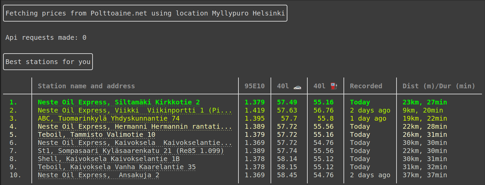

# Gasoline

Find cheapest gas station near you, in Finland.

## How it works

Scrape gas prices and calculate which station is cheapest, based on distance from a given location and amount of gasoline to refuel.

## Usage

Currently no easy way here. First you need to get a Bing api key from [here](https://docs.microsoft.com/en-us/bingmaps/getting-started/bing-maps-dev-center-help/getting-a-bing-maps-key). Put your api key to `.env.example` and rename it to `.env`.

Follow these steps to install:

```bash
$ git clone https://github.com/vaahtokarkki/gasoline.git
$ cd gasoline
$ python -m venv env
$ source env/bin/activate
$ pip install -r requirements.txt
$ python gasoline.py <location>
```
Example output:



Available parameters are:

```
Usage: gasoline.py [OPTIONS] [LOCATION]...

  Fetch cheapest gas station for you based on given location

Options:
  -c, --count INTEGER       Number of stations to display (10)
  --age INTEGER             Ignore given days older price records (5)
  -t, --to TEXT             Specify destination for route, instead of
                            calculating back and forth trip

  -a, --amount INTEGER      Amount of gasoline to refuel (40)
  -co, --consumption FLOAT  Fuel consumption of car (7.2)
  -d, --distance INTEGER    Radius from given location to include stations, or
                            in router mode distance from optimal route.
                            Defaults to 20km, in route mode 1.5km

  --help                    Show this message and exit.
```

## Built with

* [Requests](https://requests.readthedocs.io/en/master/) for HTTP
* [Beautiful Soup](https://www.crummy.com/software/BeautifulSoup/bs4/doc/) for parsing HTML
* [Bing Maps](https://docs.microsoft.com/en-us/bingmaps/rest-services/routes/) for distance calculation
* [Rich](https://github.com/willmcgugan/rich) for stylizing output
